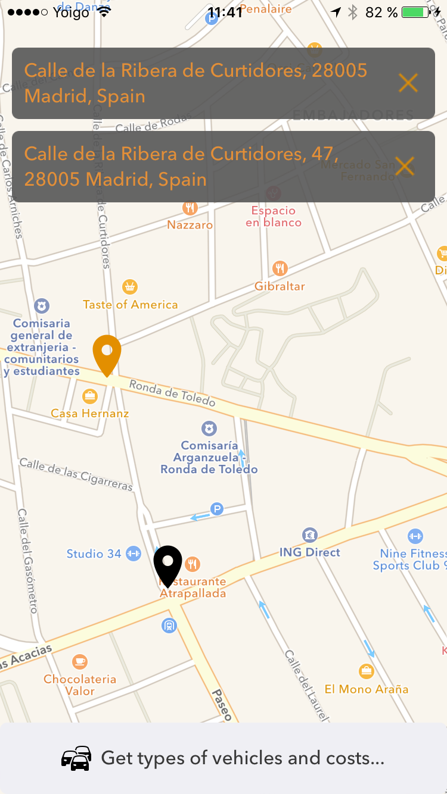
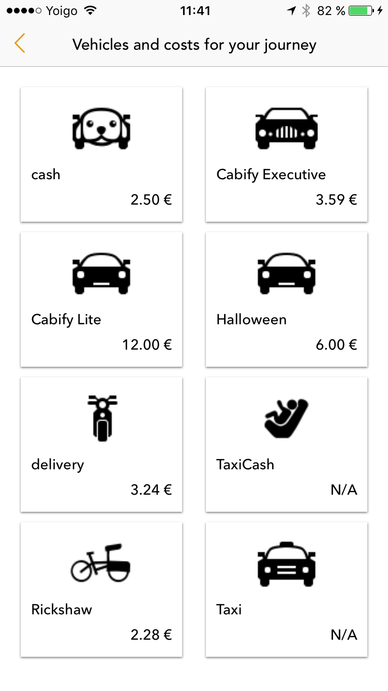

# Cabify Challenge

## by Alberto Ortega Sánchez @aortegas

### CabifyChallenge
Is a simple proyect that uses Cabify Public API, to get vehicles and costs for a specified journey by user, between a start location and a end location.

### Resources
Developed with Xcode, Swift and Cocoa Pods using RxSwift (ReactiveX for Swift, 3rd parties API) for network connections. 

Important: To open the project, you must use CabifyChallenge.xcworkspace file.

### ScreenShots

##### First Screen (Get start and end location for a journey)

##### Second Screen (Show the vehicles & cost for a journey)

